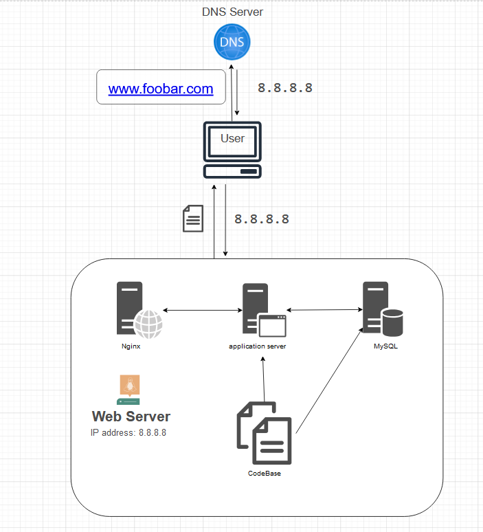

# Description
This setup is a basic web infrastructure hosting a site accessible at www.foobar.com. The server lacks firewalls and SSL certificates for network protection. All components, including the database and application server, share the server's CPU, RAM, and SSD resources.

# About The Infrastructure
## What is a server?
A server, either in hardware or software form, offers services to client computers.

## What is the role of the domain name?
A domain name acts as a user-friendly substitute for an IP address. For instance, www.wikipedia.org is simpler to recall than its numeric IP counterpart. The correlation between IP addresses and domain names is established in the DNS.

## What type of DNS record www is in www.foobar.com?
www.foobar.com utilizes an A record, verifiable via a dig command. In this infrastructure, an A record, linking a hostname to its IPv4 address, is employed.

## What is the role of the web server?
A web server, as software or hardware, handles incoming requests through HTTP/HTTPS and serves either the requested resource content or an error message.

## What is the role of the application server?
This server hosts, operates, and manages applications and services for end-users and organizations, aiding in the delivery of advanced applications.

## What is the role of the database? 
Databases store, organize, and facilitate easy access, management, and updating of information.

## What is the server using to communicate with the computer of the user requesting the website?
Communication happens over the internet using the TCP/IP protocol suite.

# Infrastructure Issues
## Presence of multiple SPOFs.
For instance, a failure in the MySQL database would bring down the entire site.

## Downtime for maintenance.
Maintenance activities require shutting down components or the server, leading to website unavailability due to the single-server setup.

## Limited scalability under high traffic.
Scaling is challenging as the sole server houses all essential components, risking resource depletion or performance reduction under heavy traffic.
