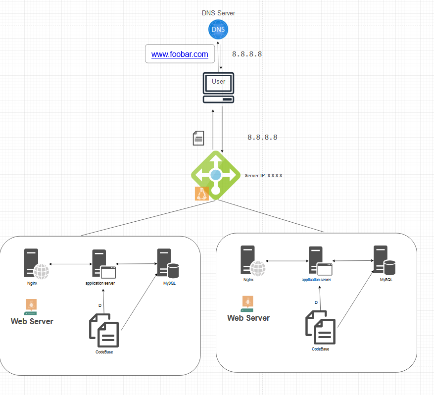

# Description
- This distributed web infrastructure is designed to optimize server traffic management by utilizing a load balancer, which evenly distributes incoming requests between a primary server and a replica server. This approach not only alleviates the load on the primary server but also ensures higher availability and efficiency in handling web traffic for `www.foobar.com

## Explaining specifics about this infrastructure

### For Every Additional Element, Why You Are Adding It

- **2 Servers**: Adding an additional server increases the infrastructure's capacity and reliability. It allows for load distribution and provides redundancy in case one server fails.
- **1 Web Server (Nginx)**: Nginx efficiently serves static content and can act as a reverse proxy for dynamic content, improving performance and scalability.
- **1 Application Server**: Hosts the application logic, separating it from the public-facing web server for better security and organization.
- **1 Load-balancer (HAproxy)**: Distributes incoming traffic across the servers, ensuring no single server becomes overwhelmed, which improves response times and availability.
- **1 Set of Application Files**: Your application's codebase, which is essential for running the website.
- **1 Database (MySQL)**: Stores all the data needed for your website, like user information and content.

### What Distribution Algorithm Your Load Balancer Is Configured With and How It Works
The load balancer could be configured with algorithms like Round Robin or Least Connections. For instance, **Round Robin** method circulates incoming requests evenly across the servers. This helps in evenly distributing the load, ensuring no single server is overwhelmed.

### Is Your Load-Balancer Enabling an Active-Active or Active-Passive Setup, Explain the Difference Between Both
In an **Active-Active** setup, both servers are actively handling traffic, maximizing resource use and offering high availability. In contrast, an **Active-Passive** setup has one server handling traffic and the other in standby, ready to take over in case the active server fails.

### How a Database Primary-Replica (Master-Slave) Cluster Works
The Primary-Replica setup in a database involves a primary server that handles all write operations, and one or more replica servers that synchronize with the primary to mirror its data. The replicas can handle read queries, reducing the load on the primary.

### What Is the Difference Between the Primary Node and the Replica Node in Regard to the Application
The **Primary Node** is responsible for all write operations (insertions, updates, deletions) in the database. The **Replica Node** typically handles read operations, offloading this task from the primary and improving read performance.

### Issues With This Infrastructure
- **Single Points of Failure (SPOFs)**: Any component without redundancy (like the load balancer or the database) can become a single point of failure.
- **Security Issues**: Without a firewall or HTTPS, the infrastructure is vulnerable to cyber attacks and data interception.
- **Lack of Monitoring**: Without monitoring, it's challenging to proactively detect and resolve issues, impacting reliability and performance.
